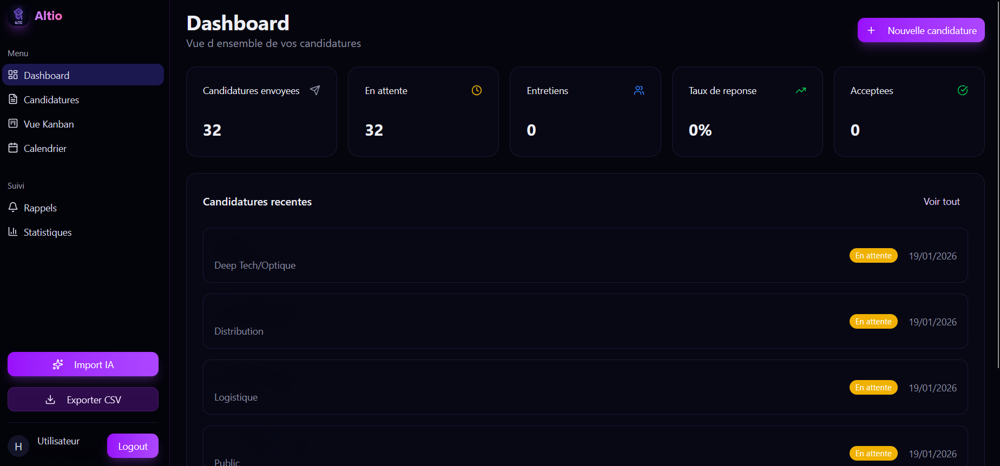
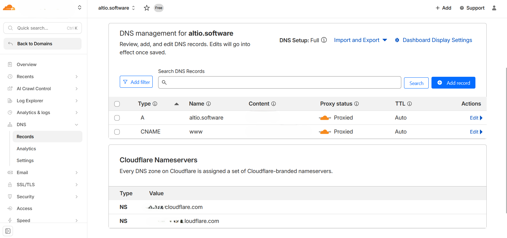
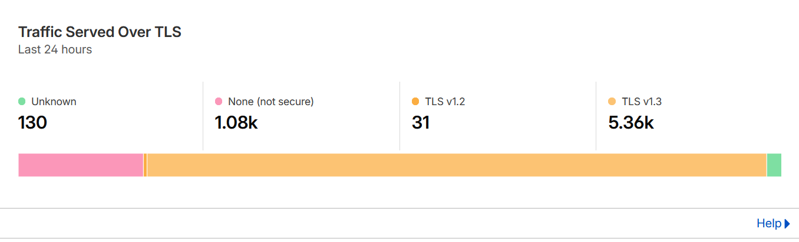
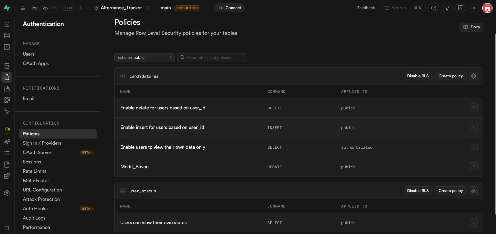
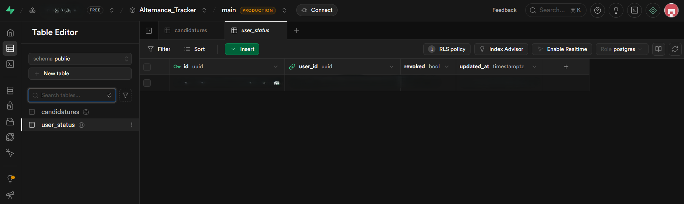

# 🚀 Altio.software - SaaS de Suivi de Candidatures Sécurisé

**Plateforme live :** [www.altio.software](https://www.altio.software)

---

## 📌 Vision du Projet
Altio est une solution Full-Stack conçue pour optimiser la recherche d'alternance. Ce projet est une démonstration technique de déploiement d'une **infrastructure Cloud moderne** et sécurisée.

## 🏗️ Administration & Infrastructure (Systèmes & Réseaux)
C'est le cœur technique du projet. L'application a été bâtie selon les principes de haute disponibilité et de **Security by Design**.

### 1. Gestion de Réseau & DNS (Cloudflare)
* **Proxying & DNS Management** : Configuration des enregistrements DNS et masquage des IP serveurs via le proxy Cloudflare.
* **Chiffrement SSL Full (Strict)** : Tunnel sécurisé de bout en bout entre le navigateur, le proxy et l'origine pour prévenir les interceptions.
* **Monitoring TLS 1.3** : Surveillance active des protocoles de chiffrement pour garantir des échanges rapides et sécurisés.

### 2. Administration de Bases de Données (PostgreSQL / Supabase)
* **Isolation des Données (RLS)** : Utilisation de politiques PostgreSQL avancées pour isoler les données. Chaque utilisateur est confiné à son périmètre via `auth.uid()`.
* **Gestion de la Session & Révocation** : Middleware vérifiant le statut de l'utilisateur (`revoked`) via une table `user_status` dédiée pour permettre une suspension d'accès instantanée.

## ⚙️ Stack Technique & DevOps
* **Environnement & Virtualisation** : Utilisation de **Docker** pour la conteneurisation des services. Culture de virtualisation acquise sur **VMware** et **Proxmox**.
* **Framework** : Next.js 14 (App Router) pour les Server Components.
* **Secret Management** : Zéro clé en clair. Utilisation exclusive des variables d'environnement injectées via Vercel.
* **Automatisation IA** : Pipeline d'importation de données structurées via LLM (Parsing de screenshots).

## 🛠️ Défis Techniques Résolus
* **Optimisation DNS** : Résolution des conflits de propagation entre le registrar et les couches Cloudflare.
* **Migration de Schéma SQL** : Audit et correction de structures complexes pour assurer l'intégrité référentielle des UUID.

---
*Note : Pour garantir la sécurité de l'infrastructure, le code source complet est hébergé sur un dépôt privé.*
